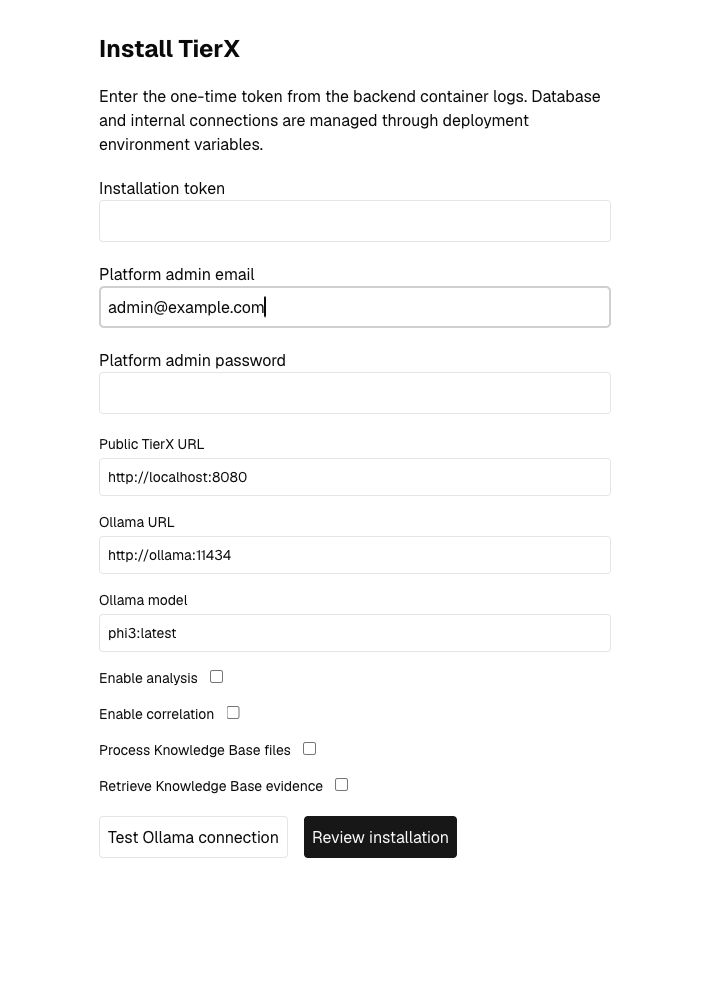
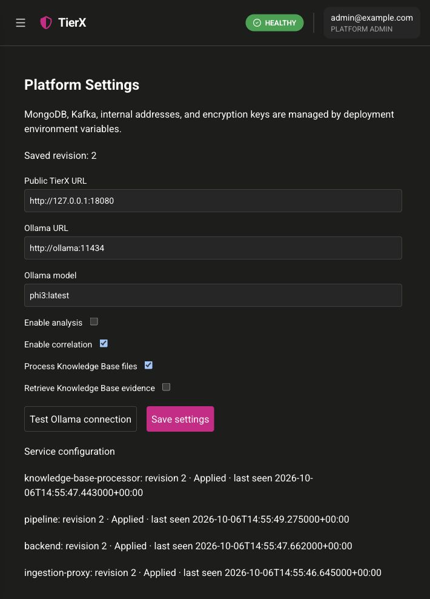

# Installation PR verification

All identities and screenshots here are synthetic. No remote deployment was
modified. The implementation is on `feature/installation-and-compose-examples`.

## Reproduction / acceptance workflow

1. Select the first released version containing this feature. Copy the complete
   `examples/usage` directory and run `node setup.mjs --release vX.Y.Z`.
2. Start either `compose.all-in-one.yaml` or `compose.external-ollama.yaml`.
3. Before setup, verify `/api/v1/health` reports `INSTALLATION_REQUIRED`, and a
   normal API returns `503`. Open `/installation` without a login.
4. Copy the one-time token from backend logs. An incorrect token must receive
   `403`. Choose a synthetic administrator, URL and model; leave analysis off
   when inference is unavailable. Review, then complete setup.
5. Sign in. Reopening setup redirects to login and rejects setup writes even
   after changing `TIERX_INSTALLATION_ENABLED`.
6. Open Settings → Platform settings. Save a valid change. Confirm backend,
   pipeline, ingestion and KB processor show the same revision after refresh.
   Submit the old revision again and expect `409`.
7. Set an environment override and restart. Its field becomes read-only.
   Remove it and restart; the saved shadow value returns.
8. Restart/recreate application containers without deleting volumes. Setup stays
   closed, login still works, and saved settings remain. The proxy re-resolves
   Docker DNS rather than retaining a replaced container's old address.
9. For environment-only setup, use a fresh database and the variables in the
   README. Missing bootstrap fields fail startup; existing administrators are
   never reset by later environment values.
10. Before enabling analysis, run the connection test against an actual Ollama
    model. Missing models, redirects and malformed structured output must fail.

## Local results

- Backend: 216 passed, 3 MongoDB-4.4-specific integration tests skipped locally
  (CI supplies that database).
- Pipeline: 105 passed, including settings snapshots, durable run identity,
  replay rewind and graceful message draining.
- Ingestion: 9 passed, including setup and database-unavailable gates.
- Frontend: 98 passed; production build passes; lint has no errors and four
  pre-existing navigation warnings.
- Setup helper: generated secrets have mode `0600`, remain unprinted, and are
  never replaced on subsequent runs. Its Node test passes.
- Both Compose variants and the semantic profile render successfully.
- A local Docker stack using locally built candidate images passed real HTTP
  setup/login/gating/revision propagation checks. Only its reverse proxy had a
  host-published port.
- A second isolated database passed environment-only bootstrap with the wizard
  disabled. Restart/recreation retained the first installation and settings.
- Production npm audit reports zero vulnerabilities; the existing bounded
  development-tool advisory exception remains unchanged.

## Remaining release verification

The current released images do not contain this PR. Released-image startup must
be verified after this branch is merged and its version is published. Local
candidate images were used to test the new behavior without publishing images.

Full all-in-one model download/inference was not completed locally: Docker
encountered a storage I/O error while pulling the large pinned Ollama image on a
host with approximately 3.7 GiB free. No unrelated images or volumes were pruned.
The current public TierX images target amd64; this local machine is ARM. Compose
rendering, application Docker builds, external-Ollama topology startup and mocked
structured preflight are verified, but this does not claim a successful real
Ollama inference. Complete that check on an adequately provisioned amd64 host.

## Screenshots

The first-run form contains no token or password. The settings image uses only
`admin@example.com`, localhost addresses, and a disposable local installation.

